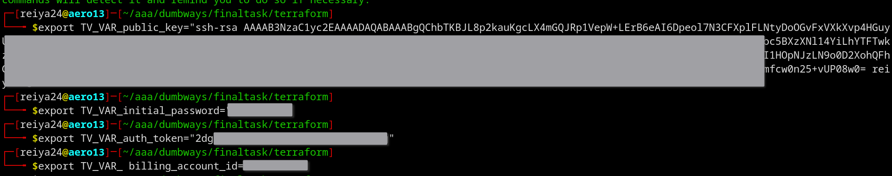

# Membuat VPS untuk Gateway, Appserver, CICD, dan Monitoring
buat sebuah file main.tf

```terraform
terraform {
  required_providers {
    idcloudhost = {
      source  = "bapung/idcloudhost"
      version = "0.1.3"
    }
  }
}

provider "idcloudhost" {
  auth_token = var.auth_token
  region = "sgp01"
}

resource "idcloudhost_vm" "appserver" {
  billing_account_id = var.billing_account_id
  name               = "appserver"
  os_name            = var.os_name
  os_version         = var.os_version
  disks              = var.disks
  vcpu               = 2
  memory             = 2048
  username           = var.username
  initial_password   = var.initial_password
  public_key         = var.public_key
}

resource "idcloudhost_floating_ip" "appserver_network" {
  name               = "My Network"
  billing_account_id = var.billing_account_id
  assigned_to        = idcloudhost_vm.appserver.id
}

resource "idcloudhost_vm" "gateway" {
  billing_account_id = var.billing_account_id
  name               = "gateway"
  os_name            = var.os_name
  os_version         = var.os_version
  disks              = 20
  vcpu               = 1
  memory             = 1024
  username           = var.username
  initial_password   = var.initial_password
  public_key         = var.public_key

}

resource "idcloudhost_floating_ip" "gateway_network" {
  name               = "My Network"
  billing_account_id = var.billing_account_id
  assigned_to        = idcloudhost_vm.gateway.id
}

resource "idcloudhost_vm" "monitoring" {
  billing_account_id = var.billing_account_id
  name               = "monitoring"
  os_name            = var.os_name
  os_version         = var.os_version
  disks              = 20
  vcpu               = 2
  memory             = 2048
  username           = var.username
  initial_password   = var.initial_password
  public_key         = var.public_key

}

resource "idcloudhost_floating_ip" "monitoring_network" {
  name               = "My Network"
  billing_account_id = var.billing_account_id
  assigned_to        = idcloudhost_vm.monitoring.id
}

resource "idcloudhost_vm" "ci_cd" {
  billing_account_id = var.billing_account_id
  name               = "ci_cd"
  os_name            = var.os_name
  os_version         = var.os_version
  disks              = 20
  vcpu               = 2
  memory             = 2048
  username           = var.username
  initial_password   = var.initial_password
  public_key         = var.public_key

}

resource "idcloudhost_floating_ip" "ci_cd_network" {
  name               = "My Network"
  billing_account_id = var.billing_account_id
  assigned_to        = idcloudhost_vm.ci_cd.id
}
```


file variable.tf
```terraform
variable "auth_token" {
  description = "masukan auth token : "
}

variable "billing_account_id" {
  description = "masukan billing account id : "
}

variable "os_name" {
  description = "masukan nama sistem operasi : "
}

variable "os_version" {
  description = "masukan versi sistem operasi : "
}

variable "disks" {
  description = "masukan jumlah storage : "
}

variable "username" {
  description = "masukan username : "
}

variable "initial_password" {
  description = "masukan password  : "
}

variable "public_key" {
  description = "masukan public key : "
}
```

file variable.tf
```terraform
variable "auth_token" {
  description = "masukan auth token : "
}

variable "billing_account_id" {
  description = "masukan billing account id : "
}

variable "os_name" {
  description = "masukan nama sistem operasi : "
}

variable "os_version" {
  description = "masukan versi sistem operasi : "
}

variable "disks" {
  description = "masukan jumlah storage : "
}

variable "username" {
  description = "masukan username : "
}

variable "initial_password" {
  description = "masukan password  : "
}

variable "public_key" {
  description = "masukan public key : "
}
```


file terraform.tfvars

```terraform
username = "reiya24"
os_name = "ubuntu"
os_version = "20.04"
```


variable yang bernilai sensitif bisa dideklarasikan di terminal
```shell
export TV_VAR_public_key=
export TV_VAR_initial_password=
export TV_VAR_auth_token=
export TV_VAR_ billing_account_id=
```


jalankan perintah terraform apply untuk menjalankan konfigurasi
```
terraform apply
```


input yes untuk melakukan konfirmasi

tunggu sampai vps berhasil dibuat


vps berhasil dibuat


# Setup ansbile

buat file ansible.cfg
```ini
[defaults]
inventory = inventory
host_key_checking = False
private_key_file = /home/reiya24/.ssh/id_rsa
interpreter_python = auto_silent
```


buat file inventory
```ini
[appserver]
103.67.186.93

[cicd]
103.67.186.92

[gateway]
103.67.186.89

[monitoring]
103.67.186.91

[all:vars]
ansible_user="reiya24"
password="$"
```


## Mematikan password login ssh via ansible

buat sebuah ansible playbook
```yaml
---
- hosts: all
  become: true
  become_user: "{{ansible_user}}"
  gather_facts: true
  tasks:
    - name: kirim folder .ssh
      copy:
        src: /home/{{ansible_user}}/.ssh/
        dest: /home/{{ansible_user}}/.ssh/
        owner: "{{ansible_user}}"
        mode: "0600"

    - name: "matikan SSH login menggunakan password"
      lineinfile:
        dest: /etc/ssh/sshd_config
        regexp: "^PasswordAuthentication"
        line: "PasswordAuthentication no"
        state: present

    - name: "restart service sshd"
      service:
        name: sshd
        state: restarted
```


catatan: untuk melakukan check syntax, gunakan perintah
```shell
ansible-playbook nama_file.yaml --syntax-check
```

jalankan ansible playbook
```shell
ansible-playbook nama_file.yaml
```


mematikakn password login ssh berhasil 


## Install Docker via Ansible

buat ansilbe playbook
```yaml
---
- hosts: all
  become: true
  gather_facts: true
  tasks:
    - name: install depedensi yang diperlukan untuk docker
      apt:
        pkg:
          - apt-transport-https
          - ca-certificates
          - curl
          - software-properties-common
          - python3-pip
          - virtualenv
          - python3-setuptools
        state: latest
        update_cache: true
    - name: tambahkan docker gpg key
      apt_key:
        url: https://download.docker.com/linux/ubuntu/gpg
        state: present
    - name: tambahkan docker repository
      apt_repository:
        repo: deb https://download.docker.com/linux/ubuntu focal stable
        state: present
    - name: install docker
      apt:
        name:
          - docker-ce
          - docker-ce-cli
          - containerd.io
          - docker-compose
          - docker-compose-plugin
        state: latest
        update_cache: yes
    - name: tambahkan user reiya24 ke group docker
      user:
        name: "{{ansible_user}}"
        groups: sudo, docker
        append: yes
```


jalankan ansible playbook
```yaml
ansible-playbook nama_file.yaml
```


## Setup nginx via Ansible

buat ansible playbook
```yaml
---
- hosts: gateway
  become: true
  gather_facts: true

  tasks:
    - name: "install nginx menggunakan apt"
      apt:
        name: nginx
        state: latest
        update_cache: true

    - name: "jalankan service nginx"
      service:
        name: nginx
        state: started

    - name: "copy file konfigurasi nginx"
      copy:
        src: sites-enabled/
        dest: /etc/nginx/sites-enabled

    - name: "restart service nginx"
      service:
        name: nginx
        state: reloaded
    - name: update snapd
      shell: "sudo snap install core; sudo snap refresh core"
    - name: install certbot
      shell: "sudo snap install --classic certbot"
    - name: certbot env
      shell: "sudo ln -s /snap/bin/certbot /usr/bin/certbot"
      ignore_errors: yes
    - name: allow plugin
      shell: "sudo snap set certbot trust-plugin-with-root=ok"
    - name: install plugin
      shell: "sudo snap install certbot-dns-cloudflare"
    - name: buat file credentials
      copy:
        dest: /home/{{ansible_user}}/cloudflare.ini
        content: |
          dns_cloudflare_email = {{email}}
          dns_cloudflare_api_key = {{api_token}}
  vars:
    - email: "reiya2307@gmail.com"
    - api_token: "api_token"
```


jalankan script ansible
```yaml
ansible-playbook nama_file.yaml
```


karena certbot tidak mengdukung mode interaktif untuk wildcard, 
kita perlu menjalankannya secara manual

```shell
certbot -i nginx \
--dns-cloudflare \
--dns-cloudflare-credentials lokasi_API-key \
-d domain_yang_ingin_didaftarkan \
-d *.domain_yang_ingin_didaftarkan
```

setup reverse proxy berhasil


## Install jenkins

instal community module docker
compose untuk ansible
```shell
ansible-galaxy collection install community.docker
```


buat ansible playbook
```yaml
---
- hosts: cicd
  become: true
  gather_facts: true
  tasks:
    - name: deploy Docker Compose
      community.docker.docker_compose:
        project_name: jenkins
        definition:
          version: '3.7'
          services:
            jenkins:
              container_name: jenkins
              image: jenkins/jenkins:latest-jdk11
              privileged: true
              user: root
              restart: unless-stopped
              ports:
                - 8123:8080
              volumes:
                - ~/jenkins_config:/var/jenkins_home
                - ~/jenkins-docker-certs:/certs/clien
```

jalankan ansible playbook
```shell
ansible-playbook nama_file.yaml
```


instalasi jenkins berhasil 


## install monitoring app

### install node exporter

buat ansible playbook
```yaml
---
- hosts: all
  become: true
  gather_facts: true
  tasks:
    - name: deploy Docker Compose
      community.docker.docker_compose:
        project_name: node_exporter
        definition:
          version: '3.7'
          services:
            node_exporter:
              container_name: node_exporter
              image: bitnami/node-exporter:latest
              stdin_open: true
              restart: unless-stopped
              ports:
                - 9100:9100
```


jalankan ansible playbook

```yaml
ansible-playbook nama_file.yaml
```


### install prometheus dan grafana

buat ansible playbook

```yaml
---
- hosts: monitoring
  become: true
  gather_facts: true
  tasks:
    - name: buat folder konfigurasi_prometheus
      file:
        path: /home/{{ansible_user}}/konfigurasi_prometheus
        state: directory
        owner: "{{ansible_user}}"

    - name: buat file konfigurasi prometheus
      copy:
        dest: /home/{{ansible_user}}/konfigurasi_prometheus/prometheus.yml
        content: |
            global:
              scrape_interval: 5s
              evaluation_interval: 5s
            
            scrape_configs:
              - job_name: prometheus
                static_configs:
                  - targets: [10.116.106.150:9100,10.116.106.170:9100,10.116.106.219:9100]
              - job_name: "Jenkins Job"
                metrics_path: '/prometheus'
                static_configs:
                  - targets: [10.116.106.170:8123]

    - name: deploy Docker Compose
      community.docker.docker_compose:
        project_name: prometheus_grafana
        definition:
          version: '3.7'
          services:
            prometheus:
              container_name: prometheus
              image: bitnami/prometheus:latest
              stdin_open: true
              restart: unless-stopped
              ports:
                - 9090:9090
              volumes:
                - /home/{{ansible_user}}/konfigurasi_prometheus/prometheus.yml:/etc/prometheus/prometheus.yml
            grafana:
              container_name: grafana
              image: grafana/grafana:latest
              stdin_open: true
              restart: unless-stopped
              ports:
                - 3123:3000
              volumes:
                - grafana-storage:/etc/grafana/provisioning
                - grafana-storage:/var/lib/grafana
                - grafana-storage:/etc/grafana/config.ini
          volumes:
            grafana-storage:
```


jalankan ansible playbook

```yaml
ansible-playbook nama_file.yaml
```


