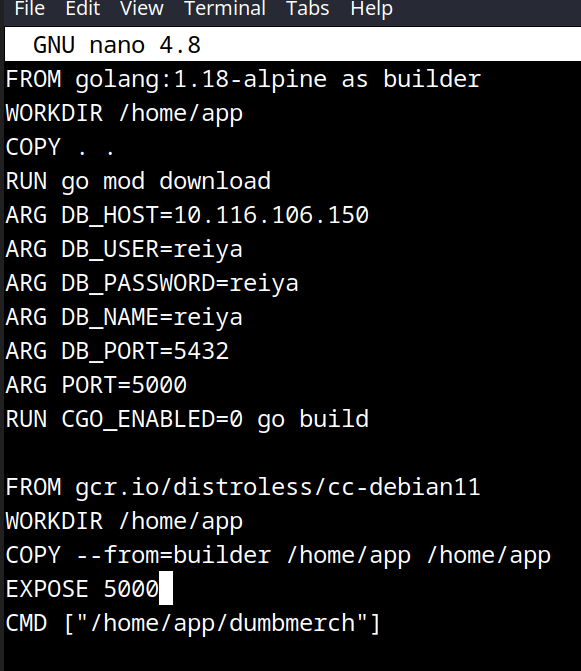
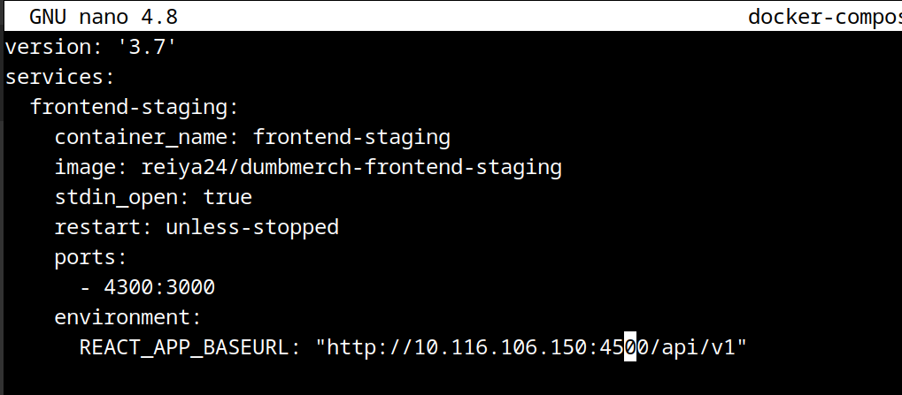
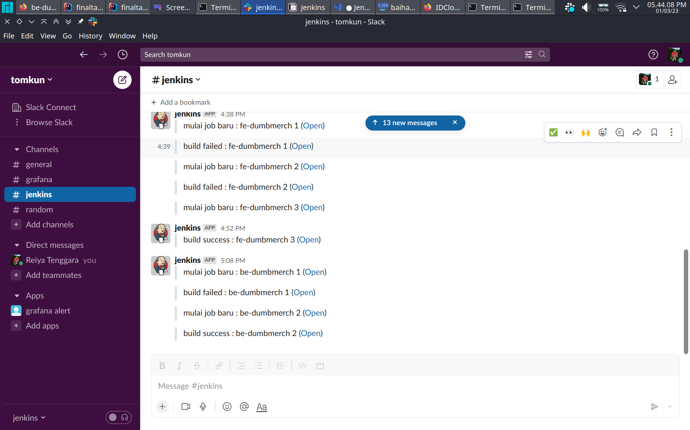

pindah ke branch production
```
git branch production
```


# Setup for production

## Setup frontend

buat file .dockerignore


buat file .env untuk menghubungkan ke API backend


buat Dockerfile

```yaml
FROM node:16-alpine as build
WORKDIR /home/app
COPY . .
RUN npm install --production
ARG REACT_APP_BASEURL="https://api.reiya.my.id/api/v1"
RUN npm run build

FROM node:16-alpine
WORKDIR /home/app
COPY --from=build /home/app /home/app
RUN npm install -g serve
EXPOSE 3000
CMD ["serve","-s","build"]
```


build Dockerfile
```yaml
docker build -t reiya24/dumbmerch-frontend-production . --progress=plain --no-cache
```


buat docker compose
```yaml
version: '3.7'
services:
  frontend-production:
    container_name: frontend-production
    image: reiya24/dumbmerch-frontend-production
    stdin_open: true
    restart: unless-stopped
    ports:
      - 3000:3000
```


jalankan docker compose
```yaml
docker compose up -d
```


## setup database

buat docker compose
```yaml
version: '3.7'
services:
  database-production:
    image: postgres:alpine
    container_name: database-production
    restart: unless-stopped
    environment:
      - POSTGRES_USER=reiya
      - POSTGRES_PASSWORD=reiya
      - POSTGRES_DB=reiya
    ports:
      - '5432:5432'
    volumes:
      - ~/konfigurasi_posgres_production:/var/lib/postgresql/data
```


jalankan docker compose
```yaml
docker compose up -d
```


## setup backend

pastikan di branch production

buat .dockerignore
```yaml
.git
.gitignore
Dockerfile
docker-compose.yaml
```


buat Dockerfile

```yaml
FROM golang:1.18-alpine as builder
WORKDIR /home/app
COPY . .
RUN go mod download
ARG DB_HOST=10.116.106.150
ARG DB_USER=reiya
ARG DB_PASSWORD=reiya
ARG DB_NAME=reiya
ARG DB_PORT=5432
ARG PORT=5000
RUN CGO_ENABLED=0 go build

FROM gcr.io/distroless/cc-debian11
WORKDIR /home/app
COPY --from=builder /home/app/dumbmerch /home/app
COPY --from=builder /home/app/.env /home/app
EXPOSE 5000
CMD ["/home/app/dumbmerch"]
```


build Dockerfile
```yaml
docker build -t reiya24/dumbmerch-backend-production . --progress=plain --no-cache
```


buat file docker compose

```yaml
version: '3.7'
services:
 backend-production:
  image: reiya24/dumbmerch-backend-production
  container_name: backend-production
  stdin_open: true
  restart: unless-stopped
  ports:
   - 5000:5000
```


jalankan docker compose
```yaml
docker compose up -d
```


integrasi backend dengan database berhasil berjalan 


# setup for staging
lakukan hal yang kurang lebih sama dengan production,
namun dengan konfigurasi Dockerfile yang sedikit berbeda

## frontend
Dockerfile
```yaml
FROM node:12.16-alpine3.11 as build
WORKDIR /home/app
COPY . .
RUN npm install

FROM node:12.16-alpine3.11
WORKDIR /home/app
COPY --from=build /home/app /home/app
EXPOSE 3000
CMD ["npm","start"]
``` 


docker compose:


## database
docker compose:
```yaml
version: '3.7'
services:
  database-staging:
    image: postgres:alpine
    container_name: database-staging
    restart: unless-stopped
    environment:
      - POSTGRES_USER=reiya
      - POSTGRES_PASSWORD=reiya
      - POSTGRES_DB=reiya
    ports:
      - '4400:5432'
    volumes:
      - ~/konfigurasi_posgres_staging:/var/lib/postgresql/data
```


## backend
Dockerfile : 

```yaml
FROM golang:1.18-alpine as builder
WORKDIR /home/app
COPY . .
RUN CGO_ENABLED=0 go build

FROM gcr.io/distroless/cc-debian11
WORKDIR /home/app
COPY --from=builder /home/app/dumbmerch /home/app
COPY --from=builder /home/app/.env /home/app
EXPOSE 5000
CMD ["/home/app/dumbmerch"]
```


docker compose : 


# CI CD menggunakan jenkins

## instalasi jenkins

copy password di
```yaml
docker logs jenkins
```


paste ke website 


pilih select plugin to install 


pilih plugin yang diperlukan 


tunggu sampai proses instalasi selesai 


masukan form 


setup domain 


## setup credentials di jenkins
pada dashboard jenkins, pergi ke manage 
jenkins > manage credentials > global > 
add credentials 


masukan private key 


## setup credentials di github
pada website github, pergi ke setting >
SSH and GPG keys > new SSH key, masukan public key 


SSH key berhasil ditambahkan 


## setup agar bisa terkoneksi dengan github di koneksi pertama
pilih manage jenkins > configure global security 


scroll ke bagian paling bawah, accept first connection 


## Setup notifikasi dengan slack
install plugin slack notification, dashboard > manage jenkins, manage plugins 


pada available plugins, cari plugin slack notification, pilih 
download now and isntall after restart 


tunggu sampai proses instalasi berhasil 


buka halaman https://my.slack.com/services/new/jenkins-ci,
lalu pilih workspace

pilih channel 


setelah itu scroll kebawah, kita akan menemukan team subdomain, dan 
integration token credential ID 


copy integration token credential ID, lalu tambahkan di credential
jenkins, pada menu kind, pilih secret text 


setelah itu, pada dashboard jenkins > manage jenkins > configure 
system, cari menu slack, masukan form yang diperlukan, untuk 
workspace masukan team subdomain tadi, disarankan untuk test 
connection terlebih dahulu sebelum save 


## membuat pipeline

klik create job, pilih pipeline job 


ceklis github hook trigger for scm polling 


definition, pilih git, masukan repository, ssh ke y, dsb 


matikan lightweight checkout

pada direktori frontend, buat Jenkinsfile

```groovy
pipeline {
    agent any

    environment{
        def branch = "production"
        def nama_repository = "origin"
        def directory = "~/fe-dumbmerch"
        def credential = 'id_rsa'
        def server = 'reiya24@10.116.106.150'
        def docker_image = 'reiya24/dumbmerch-frontend-production'
        def nama_container = 'frontend-production'
    }

    options {
        disableConcurrentBuilds()
        timeout(time: 40, unit: 'MINUTES')
    }

    stages {

        stage('kirim notifikasi ke slack') {
            steps {
                slackSend(message: "mulai job baru : ${env.JOB_NAME} ${env.BUILD_NUMBER} (<${env.BUILD_URL}|Open>)")
            }
        }

        stage('pull repository dari github ') {
            steps {
                sshagent([credential]){
                    sh"""
                    ssh -o StrictHostKeyChecking=no ${server} << EOF
                    cd ${directory}
                    git pull ${nama_repository} ${branch}
                    exit
                    EOF"""
                }
            }
        }

        stage('hapus container') {
            steps {
                sshagent([credential]){
                    sh"""
                    ssh -o StrictHostKeyChecking=no ${server} << EOF
                    docker container stop ${nama_container}
                    docker container rm ${nama_container}
                    exit
                    EOF"""
                }
            }
        }

        stage('build image frontend') {
            steps {
                sshagent([credential]){
                    sh"""ssh -o StrictHostKeyChecking=no ${server} << EOF
                    cd ${directory}
                    docker build -t ${docker_image}:latest .
                    exit
                    EOF"""
                }
            }
        }

        stage('jalankan docker compose') {
            steps {
                sshagent([credential]){
                    sh"""ssh -o StrictHostKeyChecking=no ${server} << EOF
                    cd ${directory}
                    docker compose up -d
                    exit
                    EOF
                    """
                }
            }
        }
        
        stage('push image ke dockerhub') {
            steps {
                sshagent([credential]){
                    sh"""
                    ssh -o StrictHostKeyChecking=no ${server} << EOF
                    cd ${directory}
                    docker image push ${docker_image}:latest
                    exit
                    EOF"""
                }
            }
        }
    }

    post {

        aborted {
            slackSend(message: "build digagalkan secara manual : ${env.JOB_NAME} ${env.BUILD_NUMBER} (<${env.BUILD_URL}|Open>)")
        }
        failure {
            slackSend(message: "build failed : ${env.JOB_NAME} ${env.BUILD_NUMBER} (<${env.BUILD_URL}|Open>)")
        }

        success {
            slackSend(message: "build success : ${env.JOB_NAME} ${env.BUILD_NUMBER} (<${env.BUILD_URL}|Open>)")
        }
        
    }
}
```

push ke github repository


jenkins akan membuild secara otomtatis 


notifikasi berhasil


lakukan hal yang sama untuk backend


## multibranch pipeline

install plugin multibranch scan webhook trigger 


pilih new item

masukan nama branch, pilih multibranch pipeline


setup branch source


ceklis scan by webhook 


jenkins akan mengscan branch yang memiliki Jenkinsfile 


```groovy
pipeline {
    agent any

    environment{
        def branch = "production"
        def nama_repository = "origin"
        def directory = "~/fe-dumbmerch"
        def credential = 'id_rsa'
        def server = 'reiya24@10.116.106.150'
        def docker_image = 'reiya24/dumbmerch-frontend-production'
        def nama_container = 'frontend-production'
    }

    options {
        disableConcurrentBuilds()
        timeout(time: 40, unit: 'MINUTES')
    }

    stages {

        stage('kirim notifikasi ke slack') {
            steps {
                slackSend(message: "mulai job baru : ${env.JOB_NAME} ${env.BUILD_NUMBER} (<${env.BUILD_URL}|Open>)")
            }
        }

        stage('pull repository dari github ') {
            steps {
                sshagent([credential]){
                    sh"""
                    ssh -o StrictHostKeyChecking=no ${server} << EOF
                    cd ${directory}
                    git checkout ${branch}
                    git pull ${nama_repository} ${branch}
                    exit
                    EOF"""
                }
            }
        }

        stage('hapus container') {
            steps {
                sshagent([credential]){
                    sh"""
                    ssh -o StrictHostKeyChecking=no ${server} << EOF
                    docker container stop ${nama_container}
                    docker container rm ${nama_container}
                    exit
                    EOF"""
                }
            }
        }

        stage('build image frontend') {
            steps {
                sshagent([credential]){
                    sh"""ssh -o StrictHostKeyChecking=no ${server} << EOF
                    cd ${directory}
                    docker build -t ${docker_image}:latest .
                    exit
                    EOF"""
                }
            }
        }

        stage('jalankan docker compose') {
            steps {
                sshagent([credential]){
                    sh"""ssh -o StrictHostKeyChecking=no ${server} << EOF
                    cd ${directory}
                    docker compose up -d
                    exit
                    EOF
                    """
                }
            }
        }
        
        stage('push image ke dockerhub') {
            steps {
                sshagent([credential]){
                    sh"""
                    ssh -o StrictHostKeyChecking=no ${server} << EOF
                    cd ${directory}
                    docker image push ${docker_image}:latest
                    exit
                    EOF"""
                }
            }
        }
    }

    post {

        aborted {
            slackSend(message: "build digagalkan secara manual : ${env.JOB_NAME} ${env.BUILD_NUMBER} (<${env.BUILD_URL}|Open>)")
        }
        failure {
            slackSend(message: "build failed : ${env.JOB_NAME} ${env.BUILD_NUMBER} (<${env.BUILD_URL}|Open>)")
        }

        success {
            slackSend(message: "build success : ${env.JOB_NAME} ${env.BUILD_NUMBER} (<${env.BUILD_URL}|Open>)")
        }
        
    }
}
```


## setup github webhook

pada repository github > pilih setting > webhook, masukan
```groovy
https://jenkins.reiya.my.id/multibranch-webhook-trigger/invoke?token=backend
```


push ke github 


trigger berhasil 


