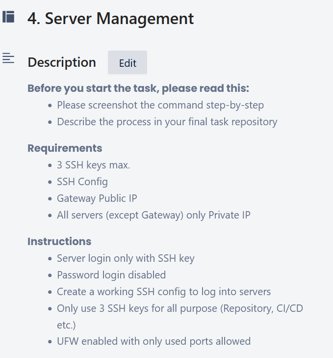
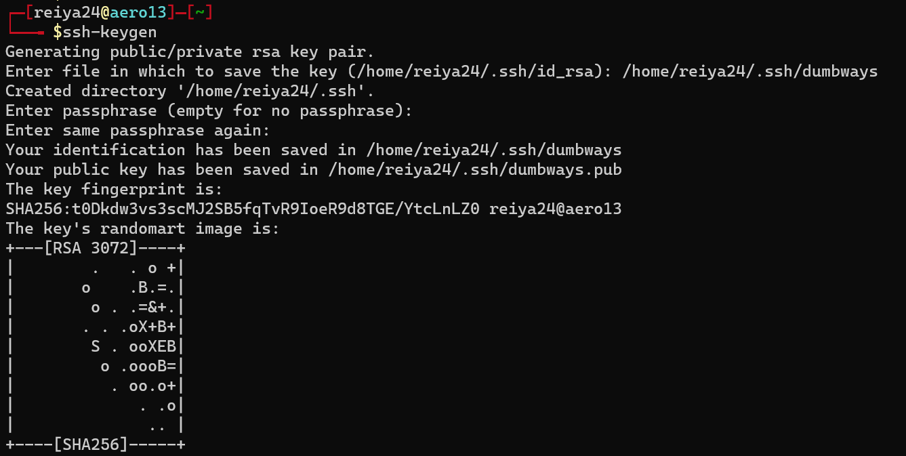
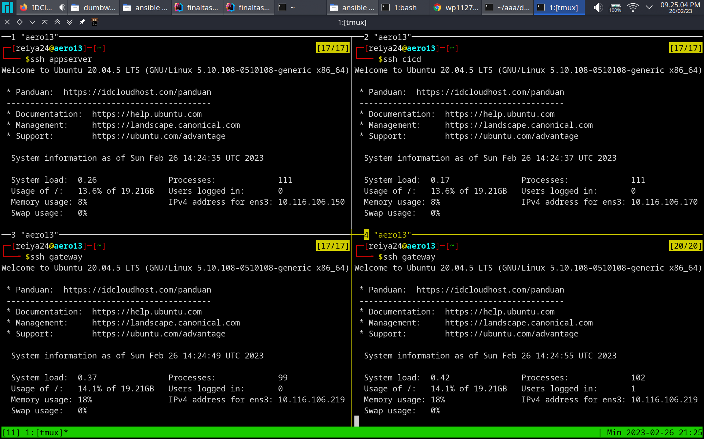
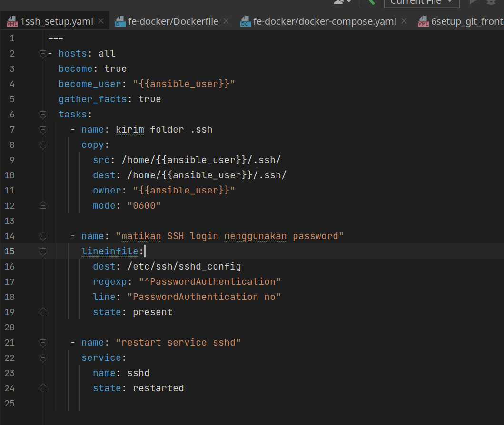
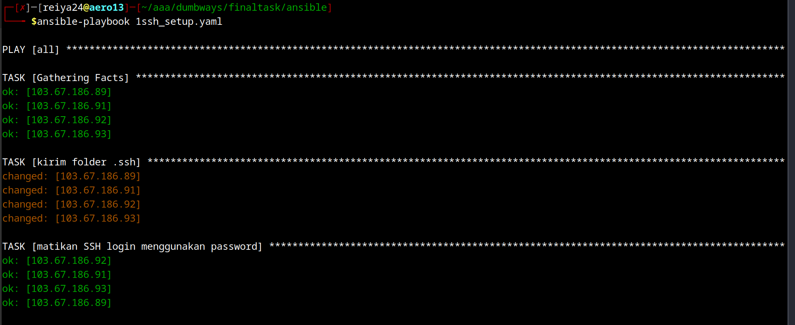
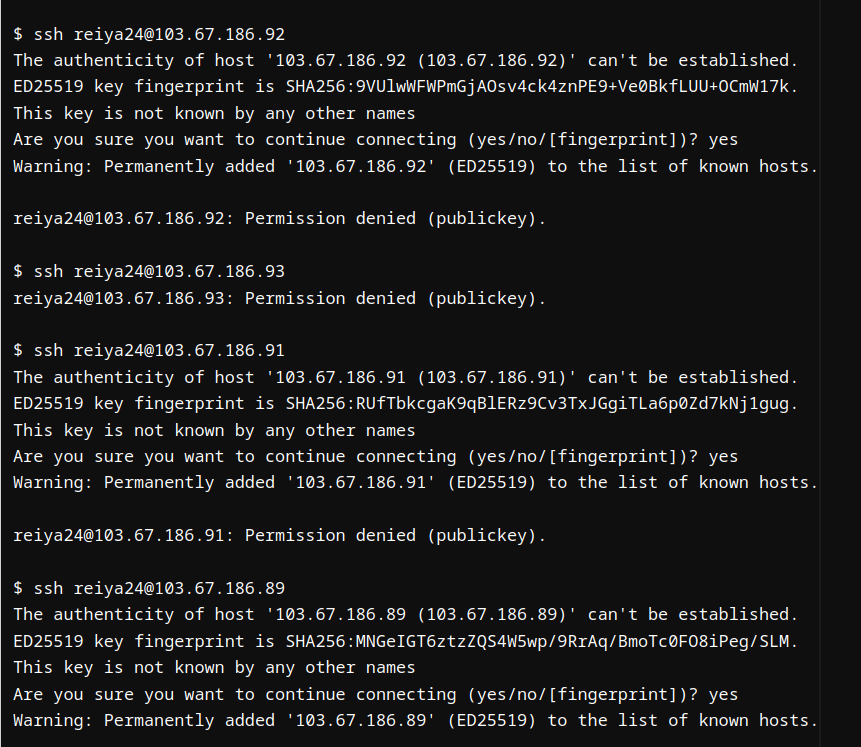
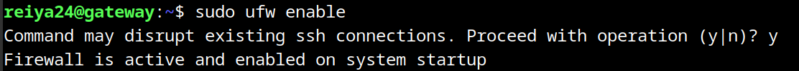
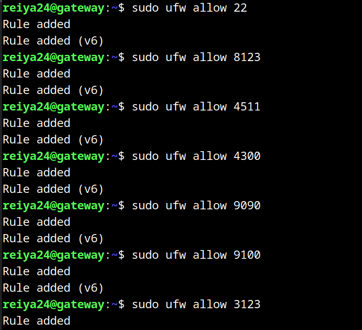

# membuat ssh config
bila belum membuat ssh key, buat menggunakan perintah

```shell
ssh-keygen
```


buat file .ssh/config
```shell
Host *
    User reiya24
    IdentityFile /home/reiya24/.ssh/id_rsa
    Port 22

Host appserver
  HostName 103.67.186.93

Host cicd
  HostName 103.67.186.92

Host gateway
  HostName 103.67.186.89

Host monitoring
  HostName 103.67.186.91

```



# Password Login Disable via ansible

buat ansible playbook

```yaml
---
- hosts: all
  become: true
  become_user: "{{ansible_user}}"
  gather_facts: true
  tasks:
    - name: kirim folder .ssh
      copy:
        src: /home/{{ansible_user}}/.ssh/
        dest: /home/{{ansible_user}}/.ssh/
        owner: "{{ansible_user}}"
        mode: "0600"

    - name: "matikan SSH login menggunakan password"
      lineinfile:
        dest: /etc/ssh/sshd_config
        regexp: "^PasswordAuthentication"
        line: "PasswordAuthentication no"
        state: present

    - name: "restart service sshd"
      service:
        name: sshd
        state: restarted
```


jalankan ansible playbook
```shell
ansible-playbook nama_file.yaml
```


mematikakn password login ssh berhasil 


# menambahkan firewall

nyalakan ufw firewall
```yaml
sudo ufw enabled
```



buka port yang hanya diperlukan 


