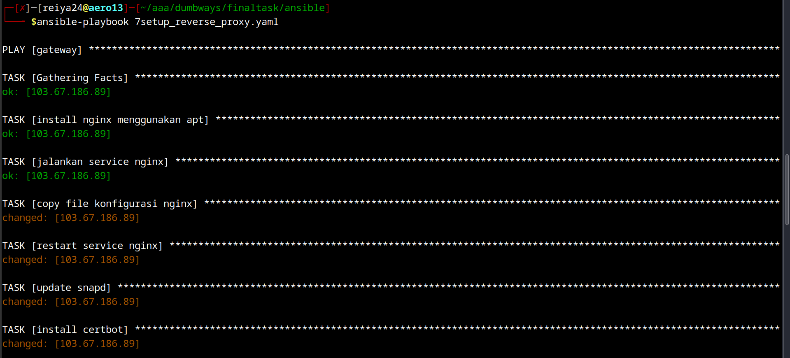

# Membuat Subdomain di Cloudflare

buka halaman cloudflare > website > pilih domain aktif > dns add record, masukan domain dan ip public dari gateway 


# Membuat API token di cloudflare

buka halaman cloudflare > my profile > API token > global API key, klik view, copy API token

# Setup reverse proxy nginx & SSL menggunakan ansible

buat sebuah file berisi konfigurasi reverse proxy,
contoh :
```shell
server {
    server_name reiya.my.id;

    location / {
             proxy_pass http://10.116.106.150:3000;
    }
}
```


buat ansible playbook

```yaml
---
- hosts: gateway
  become: true
  gather_facts: true

  tasks:
    - name: "install nginx menggunakan apt"
      apt:
        name: nginx
        state: latest
        update_cache: true

    - name: "jalankan service nginx"
      service:
        name: nginx
        state: started

    - name: "copy file konfigurasi nginx"
      copy:
        src: sites-enabled/
        dest: /etc/nginx/sites-enabled

    - name: "restart service nginx"
      service:
        name: nginx
        state: reloaded
    - name: update snapd
      shell: "sudo snap install core; sudo snap refresh core"
    - name: install certbot
      shell: "sudo snap install --classic certbot"
    - name: certbot env
      shell: "sudo ln -s /snap/bin/certbot /usr/bin/certbot"
      ignore_errors: yes
    - name: allow plugin
      shell: "sudo snap set certbot trust-plugin-with-root=ok"
    - name: install plugin
      shell: "sudo snap install certbot-dns-cloudflare"
    - name: buat file credentials
      copy:
        dest: /home/{{ansible_user}}/cloudflare.ini
        content: |
          dns_cloudflare_email = {{email}}
          dns_cloudflare_api_key = {{api_token}}
  vars:
    - email: "reiya2307@gmail.com"
    - api_token: "api_token"

```


jalankan script ansible
```shell
ansible-playbook nama_file.yaml
```


karena certbot tidak mengdukung mode interaktif untuk wildcard, kita perlu menjalankannya secara manual

```yaml
certbot -i nginx \
  --dns-cloudflare \
  --dns-cloudflare-credentials lokasi_API-key \
  -d domain_yang_ingin_didaftarkan \
  -d *.domain_yang_ingin_didaftarkan
```

setup reverse proxy berhasil 

